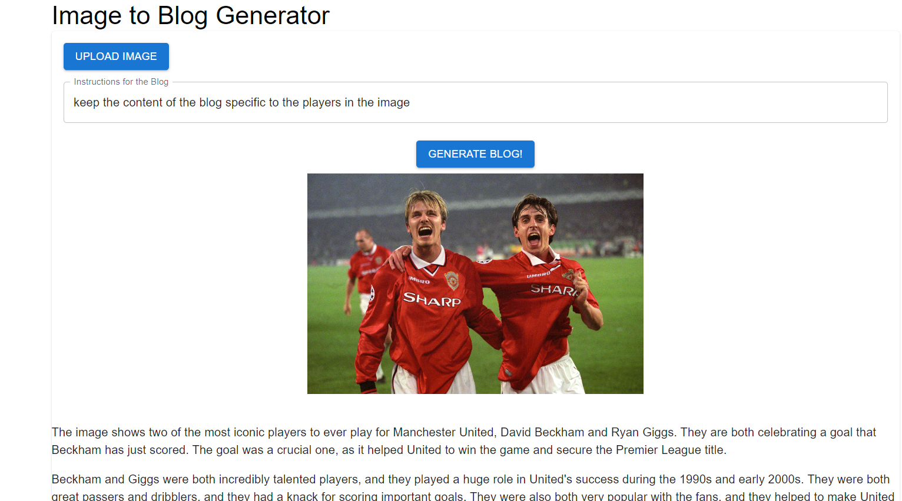

# Project Name

The project uses Google's Gemini API to create blogs from image inputs.

## Setup

### Server

1. Navigate to the `server` folder: `cd server`
2. Run `npm install` to install dependencies.
3. Create a .env file having the API KEY.
4. Start the server: `node index.js`

### Client

1. Navigate to the `client` folder: `cd client`
2. Run `npm install` to install dependencies.
3. Start the client: `npm start`

## Example

